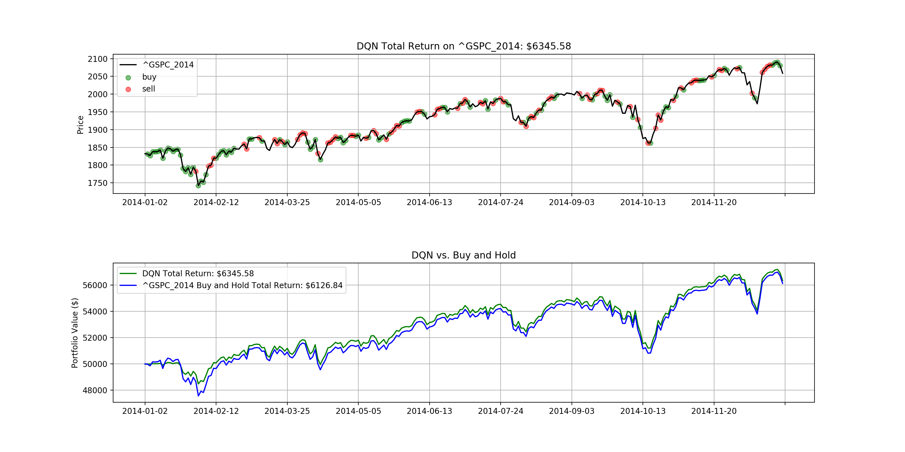

# Stock-Trading-using-Deep-Reinforcement-Learning

This project intends to leverage deep reinforcement learning in stock trading.  The reward for agents is the net unrealized (meaning the stocks are still in portfolio and not cashed out yet) profit evaluated at each action step. For inaction at each step, a negtive penalty is added to the portfolio as the missed opportunity to invest in "risk-free" Treasury bonds.

Key assumptions and limitations of the current framework:
- trading has no impact on the market
- only single stock type is supported
- only 3 basic actions: buy, hold, sell (no short selling or other complex actions)
- the agent performs only 1 action for portfolio reallocation at the end of each trade day
- all reallocations can be finished at the closing prices
- no missing data in price history
- no transaction cost

Currently, the state is defined as the normalized adjacent daily stock price differences for `n` days plus  `[stock_price, balance, num_holding]`.


### Getting Started
To install all libraries/dependencies used in this project, run
```bash
pip3 install -r requirement.txt
```

To train the DQN agent, e.g. over S&P 500 from 2010 to 2015, run
```bash
python3 train.py --model_name=model_name --stock_name=stock_name
```

- `model_name`      is the model to use:  `DQN`
- `stock_name`      is the stock used to train the model; default is `^GSPC_2010-2015`, which is S&P 500 from 1/1/2010 to 12/31/2015
- `window_size`     is the span (days) of observation; default is `10`
- `num_episode`     is the number of episodes used for training; default is `10`
- `initial_balance` is the initial balance of the portfolio; default is `50000`

To evaluate the DQN agent, run
```bash
python3 evaluate.py --model_to_load=model_to_load --stock_name=stock_name
```

- `model_to_load`   is the model to load; default is `DQN_ep10`; 
- `stock_name`   is the stock used to evaluate the model; default is `^GSPC_2018`, which is S&P 500 from 1/1/2018 to 12/31/2018
- `initial_balance` is the initial balance of the portfolio; default is `50000`

where `stock_name` can be referred in `data` directory and `model_to_laod` can be referred in `saved_models` directory.

### Example Results
Note that the following results were obtained with 10 epochs of training only. 


### References:
- [Deep Q-Learning with Keras and Gym](https://keon.io/deep-q-learning/)
- [Double Deep Q Networks](https://towardsdatascience.com/double-deep-q-networks-905dd8325412)
- [Practical Deep Reinforcement Learning Approach for Stock Trading](https://arxiv.org/abs/1811.07522)
- [Introduction to Learning to Trade with Reinforcement Learning](http://www.wildml.com/)
- [Adversarial Deep Reinforcement Learning in Portfolio Management](https://arxiv.org/abs/1808.09940)
- [A Deep Reinforcement Learning Framework for the Financial Portfolio Management Problem](https://arxiv.org/abs/1706.10059)
